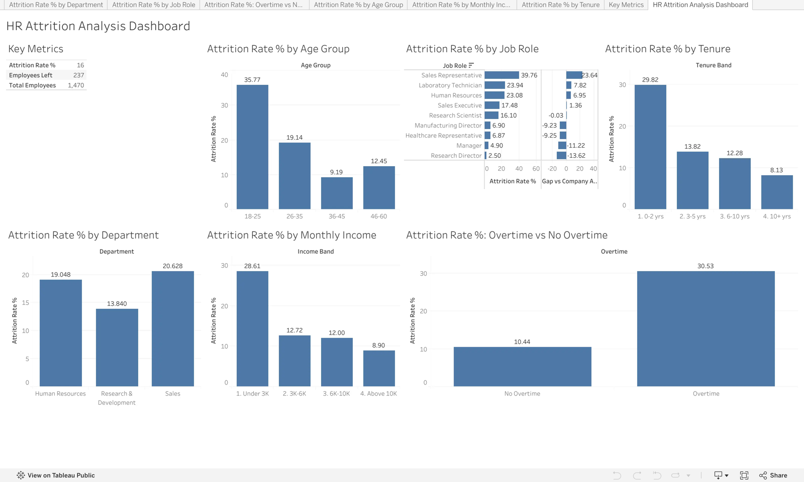
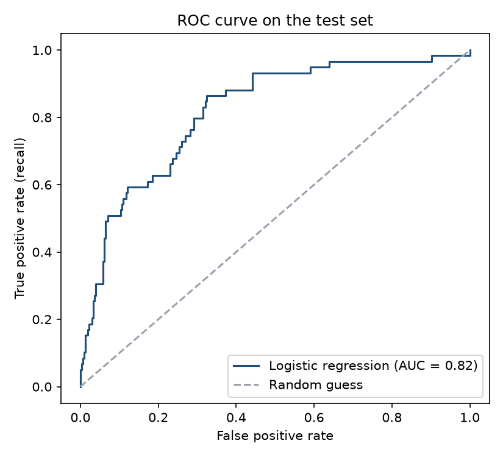

# HR Attrition Analysis

      

Analysis of employee attrition for 1,470 employees using **SQL, Python, Excel and Tableau**:
who leaves, and which factors are linked to leaving.

**Live dashboard:** [HR Attrition Analysis Dashboard (Tableau Public)](https://public.tableau.com/app/profile/vivek.prasad5963/viz/HRAttritionAnalysisDashboard_17910993091870/HRAttritionAnalysisDashboard)

[](https://public.tableau.com/app/profile/vivek.prasad5963/viz/HRAttritionAnalysisDashboard_17910993091870/HRAttritionAnalysisDashboard)

## Key findings

- Overall attrition is **16.1%** (237 of 1,470 employees).
- **Overtime** is the strongest signal: 30.5% attrition with overtime versus 10.4% without.
  Employees who work overtime **and** earn under 3K per month leave at 56.1%.
- **Sales Representatives** have the highest attrition (39.8%, 23.6 points above the company average);
  Research Directors the lowest (2.5%).
- Attrition is concentrated in **early tenure** (29.8% in the first two years) and the **18-25** age group (35.8%).
- Employees who left earned 30% less on average (4,787 vs 6,833 per month).
- Chi-square tests show attrition is significantly related to overtime, income band, tenure band, age group
  (all p < 0.001) and department (p = 0.005), but **not to gender** (p = 0.29).

## Attrition prediction model

A logistic regression model (implemented in NumPy, 16 features, stratified 75/25 train/test split) predicts who is likely to leave.

- **ROC AUC 0.82** on the hold-out test set.
- Flagging employees above the base attrition rate catches **75% of leavers** (recall 0.75, precision 0.35), which suits a retention
  programme where missing a leaver costs more than an extra check-in. At a 0.5 threshold accuracy is 0.85 versus a 0.84 baseline.
- Strongest drivers: overtime (odds ratio 2.07 per standard deviation), low environment and job satisfaction, years since last
  promotion and number of previous employers.



## Recommendations

1. Review overtime load and compensation for low-income roles, starting with Sales Representatives
   and Laboratory Technicians.
2. Strengthen onboarding and first-two-year retention (mentoring, early career-path conversations).
3. Track attrition by job role against the company average every quarter using the dashboard.

## Tools and techniques

| Area | What was done |
|---|---|
| **SQL** (SQLite) | Aggregations, CASE bands, CTE, subquery, RANK window function |
| **Python** | Pandas data preparation and banding, SciPy chi-square tests of independence |
| **Machine learning** | Logistic regression in NumPy with feature scaling, train/test split, ROC AUC, precision and recall |
| **Excel** | KPI sheet (COUNTIFS, AVERAGEIFS), three pivot tables, pivot chart, slicer |
| **Tableau** | 7-view dashboard, calculated fields, LOD expression (gap vs company average), filter action |

## Project structure

```
analysis.py          data preparation, SQL queries, chi-square tests -> outputs/
predict_attrition.py logistic regression model and evaluation -> outputs/
build_excel.py       Excel workbook with KPI formulas and pivot tables (needs Microsoft Excel)
data/                raw dataset and the cleaned file used by Tableau
outputs/             SQL results and summary.txt
excel/               hr_attrition_analysis.xlsx
```

## How to run

```powershell
pip install pandas numpy scipy matplotlib openpyxl pywin32
python analysis.py
python predict_attrition.py
python build_excel.py
```

Data: IBM HR Analytics Employee Attrition & Performance (a fictional dataset created by IBM data scientists), via Kaggle.

## Author

**Vivek Prasad** - [LinkedIn](https://www.linkedin.com/in/prasadvivek123) | [GitHub](https://github.com/Vivek346282737) | [Tableau Public](https://public.tableau.com/app/profile/vivek.prasad5963)
